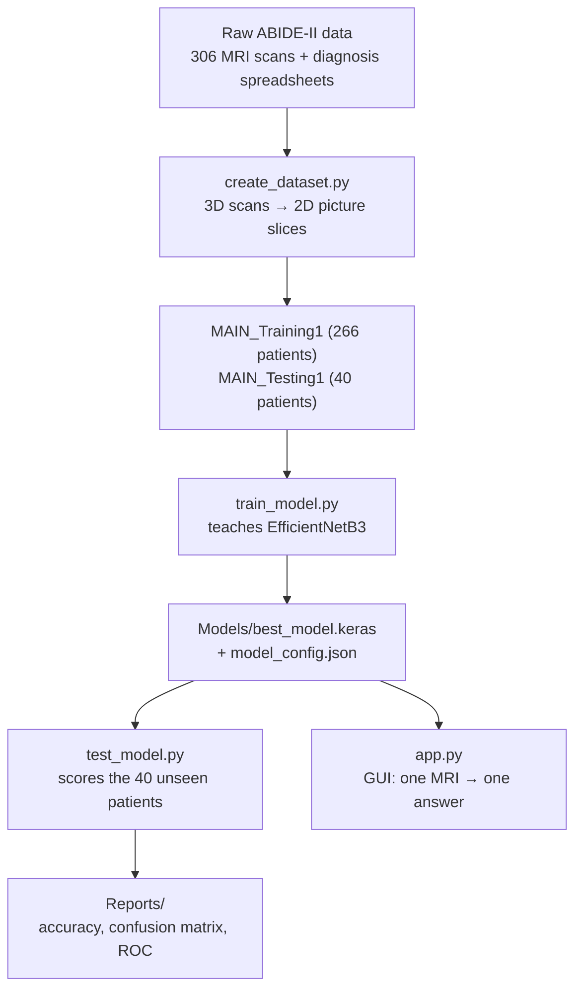
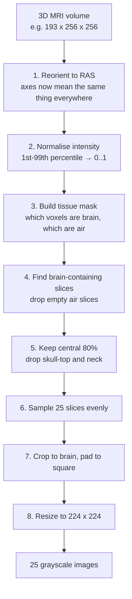
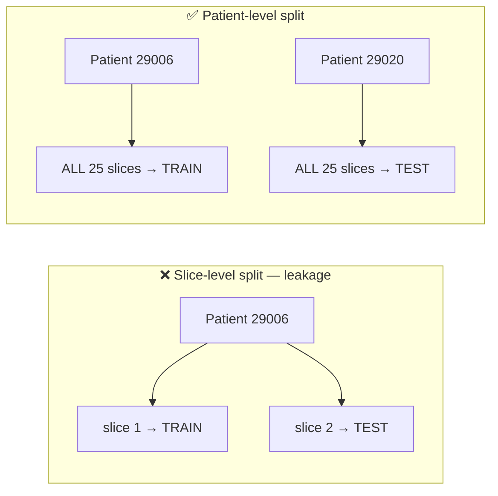
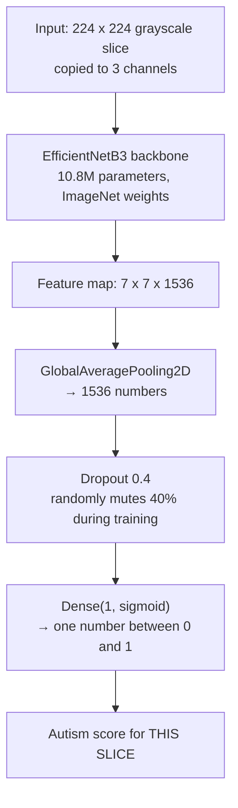
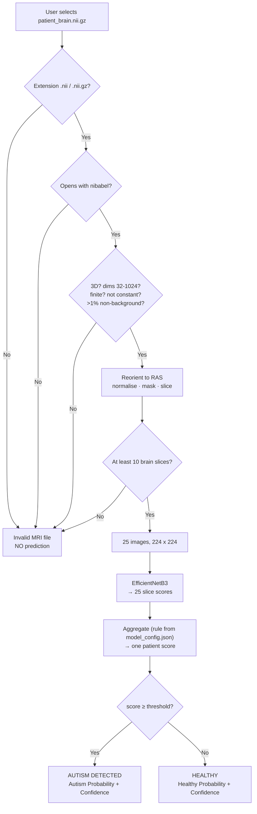

# NeuroConnect AI v2 — Technical Report

**How the system works, end to end.**

This document explains what the project does, how a brain MRI travels through
it, and why each design decision was made. It assumes no prior knowledge of
machine learning or medical imaging. Terms are explained the first time they
appear, and there is a [glossary](#15-glossary) at the end.

---

## Table of contents

1. [What this project is](#1-what-this-project-is)
2. [The problem, and why it is hard](#2-the-problem-and-why-it-is-hard)
3. [System overview](#3-system-overview)
4. [The raw material: what an MRI actually is](#4-the-raw-material-what-an-mri-actually-is)
5. [Stage 1 — Knowing who has autism](#5-stage-1--knowing-who-has-autism)
6. [Stage 2 — Turning a 3D brain into pictures](#6-stage-2--turning-a-3d-brain-into-pictures)
7. [Stage 3 — Splitting patients, not pictures](#7-stage-3--splitting-patients-not-pictures)
8. [Stage 4 — The model](#8-stage-4--the-model)
9. [Stage 5 — How the model is trained](#9-stage-5--how-the-model-is-trained)
10. [Stage 6 — From 25 scores to one answer](#10-stage-6--from-25-scores-to-one-answer)
11. [Stage 7 — Confidence](#11-stage-7--confidence)
12. [What happens when you click PREDICT](#12-what-happens-when-you-click-predict)
13. [How the system is measured](#13-how-the-system-is-measured)
14. [Honest assessment](#14-honest-assessment)
15. [Glossary](#15-glossary)

---

## 1. What this project is

NeuroConnect AI v2 is a **research prototype**. You give it one brain MRI scan
file. It gives you back one word — `AUTISM` or `HEALTHY` — plus a score saying
how strongly it leans that way.

That is the entire user-facing behaviour. Everything else in this document is
what happens in between.

> **Critical framing.** This is not a diagnostic tool and cannot become one.
> Autism is diagnosed by clinicians through behavioural observation and
> developmental history. There is no brain scan that diagnoses autism. This
> project asks a narrower research question: *does a neural network find any
> statistical signal in brain structure that correlates with an autism
> diagnosis?* The honest answer, from this project and the published
> literature, is: a weak one.

---

## 2. The problem, and why it is hard

Three things make this genuinely difficult, and they shape every design choice
that follows.

**There is no visible marker.** In a chest X-ray for pneumonia, a radiologist
can point at the cloudy patch. In an autism MRI there is nothing to point at.
Differences between groups are statistical tendencies spread across whole
populations, not features visible in one person's scan.

**The data is small.** This project has **306 patients**. Modern image networks
are normally trained on millions of images. With 306 people, a large network
can simply memorise them — learning "this particular brain is autistic" instead
of anything generalisable. That failure is called **overfitting**, and much of
the design below exists to prevent it.

**The scanners differ.** The data comes from five research sites, each with its
own MRI machine and settings. A network can easily learn to recognise *the
scanner* rather than *the brain*. If one site happened to have more autism
cases, the model could score well by identifying that site — and be useless on
any new scan. This is called **confounding**, and section 7 explains how it is
controlled.

---

## 3. System overview

The project is four programs that run in sequence, plus shared code.



| File | Role |
|---|---|
| `neuro_utils.py` | Reads MRI files, validates them, converts 3D → slices |
| `create_dataset.py` | Builds the training and testing datasets |
| `train_model.py` | Trains the network |
| `predictor.py` | Loads the trained model and produces one patient answer |
| `test_model.py` | Measures accuracy on unseen patients |
| `app.py` | The graphical interface |

`neuro_utils.py` and `predictor.py` are shared deliberately. The **exact same
code** converts an MRI during training and during prediction. If those two ever
differed, the model would be fed different-looking images than it learned from
and would silently degrade.

---

## 4. The raw material: what an MRI actually is

A brain MRI is **not a photograph**. It is a 3D block of numbers.

Picture a loaf of bread. The loaf is the head. An MRI machine measures the
tissue density at every point inside it, producing a 3D grid of values called
**voxels** (3D pixels).

One scan in this project looks like:

```
shape:  (193, 256, 256)      = 12,648,448 voxels
type:   float32
size:   ~8 MB compressed (.nii.gz)
```

Those three numbers are the grid dimensions. Slicing the loaf gives flat
images:

- **Axial** — horizontal slices, as if from the top down ← *this project uses these*
- **Coronal** — front-to-back slices
- **Sagittal** — left-to-right slices

The file format is **NIfTI** (`.nii`, or `.nii.gz` compressed) — the standard
for neuroimaging. Besides voxels it stores an **affine matrix** describing how
the grid is oriented in real-world space. That matrix matters enormously, as
the next section shows.

### The five sites do not agree

| Site | Volume shape | Data type | Voxel size (mm) |
|---|---|---|---|
| BNI_1 | (193, 256, 256) | float32 | 1.05 |
| GU_1 | (176, 256, 256) | float32 | 1.00 |
| SDSU_1 | (172, 256, 256) | float32 | 1.00 |
| STANFORD | (256, 256, 166) | int16 | 0.94 |
| TCD_1 | (256, 256, 180) | int16 | 0.90 |

Different grid sizes, different number formats, different physical resolutions,
**and the axes are stored in different orders**. Notice that for BNI the
166-to-193 dimension is first, but for Stanford it is last. Slicing every file
along "axis 2" would give axial slices for some sites and sagittal for others —
completely different pictures fed to the model as if they were the same thing.

Handling this is the first job of the pipeline.

---

## 5. Stage 1 — Knowing who has autism

Each site ships a spreadsheet (`ABIDEII-<site>.csv`) with one row per patient.
Two columns matter:

| Column | Meaning |
|---|---|
| `SUB_ID` | The patient's ID number, e.g. `29006` |
| `DX_GROUP` | Diagnosis: **1 = Autism**, **2 = Healthy** |

The code reads every CSV and builds a lookup table: *patient ID → diagnosis*.
No patient ID is ever typed by hand.

### Two real problems solved here

**Not all files are UTF-8.** `ABIDEII-GU_1.csv` is Latin-1 encoded; reading it
as UTF-8 crashes. The loader tries four encodings in order (`utf-8-sig`,
`utf-8`, `latin-1`, `cp1252`) and uses the first that works.

**Folder names do not match file names.** The MRI folder is called
`ABIDEII-STANFORD`, but its spreadsheet is `ABIDEII-SU_2.csv`. Nothing links
them by name.

The fix is to ignore names entirely and **match on patient ID**. The code reads
all spreadsheets into one table, then walks every site folder and looks up each
subject folder's number. `ABIDEII-STANFORD` contains subjects 30168–30209, and
those IDs are listed in `ABIDEII-SU_2.csv`, so they resolve automatically.

This is not just a convenience. A hard-coded mapping table would silently break
the moment someone downloads a different subset of ABIDE-II. Matching on IDs
works for any subset, on any machine.

**Result:** 306 patients with valid diagnoses — 155 Autism, 151 Healthy.

---

## 6. Stage 2 — Turning a 3D brain into pictures

This is the heart of the input processing. A 12-million-voxel 3D volume must
become a handful of 224×224 images the network can read.



### Step 1 — Reorient to RAS

Using the NIfTI affine matrix, every volume is rotated into a standard
orientation called **RAS**: axis 0 increases toward the **R**ight, axis 1 toward
the **A**nterior (front), axis 2 toward the **S**uperior (top of head).

After this, "slice along axis 2" means *axial slice* for every file from every
site — and for any file a user later drops into the GUI. This one step erases
the axis-order chaos from section 4.

### Step 2 — Normalise intensity

MRI values are **not calibrated**. Unlike a thermometer, a value of 800 has no
fixed meaning; it depends on the machine and settings. One scanner's "bright
white matter" might be 400, another's 1200.

The fix: for each scan, find the 1st and 99th percentile of non-background
voxels, then rescale that range to 0–1. Percentiles rather than min/max, because
a single hot voxel from scanner noise would otherwise squash the whole image
into darkness.

Now every scan is on a comparable brightness scale.

### Step 3 — Build a tissue mask

Everything brighter than 0.12 (on the new 0–1 scale) is marked as tissue;
everything below is air or background. This gives a 3D true/false map of where
the head is.

### Step 4 — Find brain-containing slices

Most slices at the top and bottom of the scan are pure black air. For each
axial slice, the code computes what fraction of its pixels are tissue. Slices
below **5%** are discarded.

### Step 5 — Keep the central 80%

Of the slices that survive, the outermost 10% at each end are dropped. The very
top of the skull and the bottom of the cerebellum/neck contain little useful
brain tissue and mostly show bone.

### Step 6 — Sample 25 slices evenly

From the remaining range, 25 slices are taken at **even intervals** — bottom to
top, evenly spaced.

Two deliberate decisions here:

**Why evenly spaced, not random?** Random selection would make the dataset
irreproducible, and could miss whole brain regions for some patients. Even
spacing guarantees consistent anatomical coverage for everyone.

**Why 25?** A trade-off. More slices means more data and more coverage, but
training time scales directly with slice count. On a CPU-only machine, 25
slices per patient gives 6,650 training images and roughly 3 hours of training.
50 would double that. This number is a single constant
(`SLICES_PER_PATIENT` in `neuro_utils.py`) and is easy to change.

### Step 7 — Crop to the brain, pad to square

Each slice is cropped to the brain's bounding box, removing black margins that
differ by site. It is then padded to a square with black.

**Why pad instead of just resizing?** A 176×256 slice squashed directly into
224×224 would compress the brain horizontally — anatomy distorted differently
at each site. Padding first preserves the true proportions.

### Step 8 — Resize to 224×224

224×224 is the input size EfficientNetB3 expects. The image is saved as a JPG.

### The result

Every patient, from every site, becomes 25 clean, comparable, 224×224 grayscale
brain images.

```
Training images : 6,650   (266 patients × 25)
Testing images  : 1,000   (40 patients × 25)
Patients skipped: 0       (all 306 scans were valid)
```

---

## 7. Stage 3 — Splitting patients, not pictures

**This is the single most important correctness decision in the project.**

To know whether a model has genuinely learned, you test it on data it has never
seen. The obvious approach — shuffle all 7,650 images and hold back 20% — is
**catastrophically wrong here**.

Why: slices 1 and 2 from patient 29006 are nearly identical pictures of the same
brain. If slice 1 goes to training and slice 2 to testing, the model has
effectively already seen the test image. It can memorise patient 29006 and score
brilliantly, while being useless on a genuinely new person.

This is **data leakage**, and it is the most common way medical AI results get
inflated.



So the split happens **by patient**. Every one of a patient's 25 slices goes to
exactly one side. This is enforced, not merely intended: after writing the
files, `create_dataset.py` re-reads the folders and fails if any patient ID
appears on both sides. `test_model.py` independently re-checks before scoring.

### Balancing across sites

The 40 held-out patients are chosen **round-robin across the five sites**:

| Site | Autism | Healthy |
|---|---|---|
| BNI_1 | 4 | 4 |
| GU_1 | 4 | 4 |
| SDSU_1 | 4 | 4 |
| STANFORD | 4 | 4 |
| TCD_1 | 4 | 4 |

This directly addresses the confounding problem from section 2. Because every
site contributes equally and is internally balanced, **a model that only
recognised the scanner would score exactly 50%** — chance. Any accuracy above
chance must come from something else.

### Three groups, not two

```
306 patients
├── 40  held-out TEST      — untouched until the very end
└── 266 training pool
    ├── 213 TRAIN          — the model learns from these
    └── 53  VALIDATION     — used to tune settings
```

The validation set exists because tuning decisions — which aggregation rule,
which decision threshold, when to stop training — must be made on data the model
did not train on. But if those choices were made using the *test* set, the test
set would no longer be unseen, and its accuracy would be optimistic.

So the validation patients absorb all tuning, and the 40 test patients are
opened exactly once, at the end.

---

## 8. Stage 4 — The model

### The idea in plain terms

A **convolutional neural network** (CNN) learns to recognise images in layers.
Early layers detect simple things — edges, corners, textures. Middle layers
combine those into shapes and patterns. Deep layers combine those into complex
concepts. Nobody programs these features; the network discovers them by being
shown examples and corrected when wrong.

### Transfer learning: why we don't start from scratch

Training a CNN from zero needs millions of images. We have 6,650.

The solution is **transfer learning**. We start with **EfficientNetB3**, a
network already trained on ImageNet — 1.2 million everyday photographs across
1,000 categories. In learning to tell cats from cars, it developed a rich
general-purpose ability to detect edges, textures, curves and shapes.

Those low-level abilities transfer. A network that can perceive texture and
structure in photographs can perceive texture and structure in brain tissue. We
keep that visual machinery and retrain only the part that makes the final
decision.

### Architecture



**Grayscale to 3 channels.** EfficientNetB3 expects colour images. Our slices
are grayscale, so the single channel is copied three times. This is intentional
— it lets us use the ImageNet weights unchanged rather than discarding the
first layer.

**Global average pooling** collapses the 7×7×1536 feature map into 1536 numbers
by averaging each feature across the image, summarising *what* was found rather
than *where*.

**Dropout 0.4** randomly silences 40% of those numbers during each training
step. This sounds destructive but prevents the network relying too heavily on
any single feature — an anti-overfitting measure that matters greatly with only
266 patients.

**Dense(1, sigmoid)** is the decision layer: one number between 0 and 1. 0 means
"confidently Healthy", 1 means "confidently Autism".

---

## 9. Stage 5 — How the model is trained

### Two stages, deliberately

Training happens in two phases with very different settings.

| | Stage 1 | Stage 2 |
|---|---|---|
| **What learns** | Only the final decision layer | Upper backbone blocks too |
| **Backbone** | Frozen | `block6a` upward unfrozen |
| **Learning rate** | 1e-3 (fast) | 1e-5 (100× slower) |
| **Purpose** | Learn to use existing features | Gently adapt features to brain tissue |

**Why not train everything at once?** The final layer starts with random
weights, producing large, meaningless error signals. If the backbone were
unfrozen, those wild corrections would flow back and destroy the carefully
learned ImageNet features before they could be useful — like rebuilding a house's
foundation while still deciding on the paint colour.

Stage 1 lets the decision layer settle using good, frozen features. Only then,
in stage 2, are the upper layers nudged — at a learning rate 100× smaller, so
adjustments are gentle.

**Why only the upper blocks?** Two reasons. Early CNN layers detect universal
features (edges, textures) that need no adaptation; only deep layers encode
task-specific concepts. And practically: unfreezing everything is ~11× slower
per step on CPU (measured: 3.7 vs 41.5 images/second) and overfits badly at this
dataset size.

**BatchNorm layers stay frozen** throughout stage 2. These layers hold running
statistics learned from 1.2 million ImageNet images; re-estimating them from a
few hundred brains is a well-known cause of fine-tuning collapse.

### Data augmentation

Each training image is randomly altered slightly every time it is shown:

| Transformation | Amount | Why it is safe |
|---|---|---|
| Horizontal flip | 50% chance | The brain is roughly symmetric about the midline |
| Rotation | ±4% | Head tilt varies between scans anyway |
| Zoom | ±8% | Head size and scanner distance vary |
| Translation | ±5% | Head position in the scanner varies |
| Contrast jitter | ±15% | Scanner contrast varies |

This means the model effectively never sees the identical image twice, which
combats memorisation. The amounts are deliberately mild — aggressive rotation
would create anatomically impossible brains and teach the model nonsense.

### Guardrails during training

- **ModelCheckpoint** — saves a copy whenever validation AUC improves, so the
  best version is kept even if later epochs get worse
- **EarlyStopping** — halts if validation stops improving for 6 epochs
- **ReduceLROnPlateau** — cuts the learning rate in half when progress stalls
- **Class weights** — slightly upweights the rarer class so the model cannot
  win by always guessing the majority

### Efficiency

Decoded images are cached in RAM (~270 MB) after the first epoch, so the 6,650
JPGs are read and decoded **once per run** rather than once per epoch.

---

## 10. Stage 6 — From 25 scores to one answer

The network scores **slices**, but a user needs **one answer per person**. A
patient produces 25 numbers like:

```
0.61, 0.48, 0.72, 0.55, 0.43, 0.68, 0.51, ...
```

These must become one. That combining step is **aggregation**, and five rules
were implemented and compared:

| Rule | How it works |
|---|---|
| **Mean** | Plain average of all 25 |
| **Median** | Middle value when sorted |
| **Trimmed mean** | Drop the extreme 20% at each end, average the rest |
| **Top-third mean** | Average only the 8 most autism-like slices |
| **Mean of logits** | Average in log-odds space, then convert back |

Each has a rationale. The mean uses all evidence but is dragged by outliers.
The median ignores extremes entirely. The top-third mean assumes any signal
might be focal — present in some brain regions but not all.

**The winner is chosen by measurement, not by opinion.** All five are evaluated
on the **validation patients**, and the one with the best patient-level AUC
wins. The choice is written to `Models/model_config.json`.

### The decision threshold

An aggregated score of, say, 0.58 must become a word. The obvious cut is 0.5,
but that is rarely optimal.

The threshold is chosen on the validation patients by maximising **Youden's J**
(sensitivity + specificity − 1) — the point best balancing catching true autism
cases against false alarms. It typically lands slightly off 0.5.

This has a visible consequence. If the threshold is 0.529 and a patient scores
0.443 autism, the verdict is HEALTHY with a Healthy score of 55.7%. If they
score 0.513 the verdict is still HEALTHY, but the Healthy score reads 48.7% —
below half. That looks odd but is the model's genuine number, displayed
unaltered rather than rescaled to look tidier. Such cases are always flagged
**Low confidence**.

> **Both the aggregation rule and the threshold are chosen on validation
> patients — never on the 40 test patients.** Tuning either against the test set
> would make the final accuracy figure meaningless.

---

## 11. Stage 7 — Confidence

The displayed confidence percentage is **slice agreement**: the share of the
patient's 25 slices whose individual scores fell on the same side of the
threshold as the final verdict. 21 of 25 agreeing gives 84%.

This deliberately is **not** a restatement of the probability. It answers a
different question: *how consistent was the evidence?*

Consider two patients who both score 60% autism:

- Patient A: every slice scored ≈0.60 → **96% agreement**, a steady result
- Patient B: half the slices scored 0.95, half scored 0.25 → **50% agreement**,
  the model is deeply conflicted and the average merely hides it

Identical probabilities, completely different reliability. Only agreement
reveals it.

### The High / Moderate / Low label

The label takes the **weaker of two signals**:

| Signal | Question | High | Moderate |
|---|---|---|---|
| Slice agreement | Were the slices consistent? | ≥85% | ≥70% |
| Margin from threshold | Did the score clear the line decisively? | ≥0.25 | ≥0.10 |

So `Confidence: 92.0% (Low)` is legitimate and informative: the slices agreed
strongly, but the aggregate score only barely crossed the decision line. Strong
consensus on a near-coin-flip verdict is still a near-coin-flip verdict.

> **Confidence measures the model's internal agreement, not medical certainty.**
> 90% confidence does not mean the answer is 90% likely to be correct. A model
> can be confidently wrong. The question "how often is it right?" is answered
> only by the held-out test accuracy.

---

## 12. What happens when you click PREDICT



Two properties worth noting.

**It fails closed.** Every validation failure leads to the same place: a refusal
with no prediction. The system never guesses on input it does not understand.
Feeding it a spreadsheet, a photograph, or a corrupted file produces *"Invalid
MRI file"*, not a diagnosis.

**Slice results are never shown.** The 25 individual scores exist internally and
are used to compute confidence, but the interface shows only the final
patient-level result. Displaying 25 contradictory per-slice verdicts would
invite misreading them as 25 independent opinions.

The GUI runs prediction on a **background thread**, so the window stays
responsive while the model works.

---

## 13. How the system is measured

`test_model.py` opens the 40 held-out patients and reports:

| Metric | Question it answers |
|---|---|
| **Accuracy** | Of all 40 patients, what fraction were labelled correctly? |
| **Precision** | When it says AUTISM, how often is that right? |
| **Recall (sensitivity)** | Of patients who truly have autism, how many were caught? |
| **F1** | The balance between precision and recall |
| **AUC** | How well the scores rank autism patients above healthy ones, independent of any threshold |
| **Confusion matrix** | The full breakdown of correct and incorrect calls for each class |

### Why AUC is reported alongside accuracy

Accuracy depends on the chosen threshold; AUC does not. AUC asks: *if you drew
one autistic and one healthy patient at random, how often would the model give
the autistic one a higher score?* 0.5 is pure chance, 1.0 is perfect. It is the
better measure of whether the model has learned anything at all.

### Measured result

| Metric | Validation (53) | **Held-out test (40)** |
|---|---|---|
| Accuracy | 71.7% | **52.5%** |
| AUC | 0.719 | **0.598** |
| Precision / Recall / F1 | — | 0.529 / 0.450 / 0.487 |

The 85% target was not met. AUC 0.598 against 0.5 for chance means the model
found only a very weak signal: mean patient score 0.650 for autism versus 0.614
for healthy — a separation of 0.036, with the two groups heavily interleaved
when sorted by score.

**Method disclosure.** The held-out set was evaluated twice. The first run used
`top_k_mean` aggregation and scored 45.0%. That rule was then dropped for two
reasons, both independent of the test outcome: its threshold is not on the
individual-slice scale, which made the reported confidence incoherent (one
patient was called AUTISM while 84% of their slices scored below the line); and
it had beaten plain `mean` by only 0.014 AUC on 53 validation patients, well
inside noise. The selection code now excludes scale-incompatible rules and
requires a 0.03 AUC margin before preferring anything over `mean`. Nonetheless,
52.5% is a second look at the same held-out set and is slightly optimistic for
that reason.

### Where results are written

```
Reports/classification_report.txt   full metrics + per-patient scores
Reports/confusion_matrix.png
Reports/roc_curve.png
Reports/test_results.json           machine-readable
Reports/accuracy.png, loss.png      training curves
```

---

## 14. Honest assessment

### What this project does well

The **methodology is sound**. Patient-level splitting is enforced by code, not
convention. The test set is site-balanced so scanner recognition cannot inflate
the score. Tuning decisions are made on validation patients, leaving the test
set genuinely unseen. The same preprocessing code runs at training and
prediction time. All 306 scans processed without a single failure.

### What it cannot do

**It cannot diagnose autism.** Not because of an implementation shortcoming, but
because the signal largely is not there. Autism is a behavioural and
developmental condition. Structural brain differences between autistic and
non-autistic people exist at the population level but are small, inconsistent,
and heavily overlapping between individuals.

Published patient-level results on ABIDE using structural MRI generally land in
the **60–75%** range. A result far above that should raise suspicion of data
leakage before celebration.

### Known limitations

- **306 patients** is very small for a 10.8M-parameter network
- **2D, not 3D** — slices are scored independently; 3D structure is not modelled
- **Site variability** remains in the training data even though the test set is
  balanced
- **8 patients per site** in the test set means per-site figures carry very wide
  error bars
- **Single train/test split** — no cross-validation, so the reported figure has
  meaningful variance
- **A 40-patient test set** means one patient is worth 2.5 percentage points

### What would actually improve it

In rough order of expected impact:

1. **More data** — ABIDE-I adds ~1,100 more subjects
2. **3D CNNs** or multi-view models that see the whole volume at once
3. **Skull stripping and spatial registration** to a standard brain template,
   removing anatomy irrelevant to the question
4. **Functional MRI** — connectivity between brain regions carries more signal
   for autism than structure does; the resting-state scans are already in ABIDE
5. **Cross-validation** for a more stable estimate
6. **Explicit site harmonisation** (e.g. ComBat) to remove scanner effects

---

## 15. Glossary

| Term | Meaning |
|---|---|
| **Aggregation** | Combining many slice scores into one patient score |
| **AUC** | Probability the model ranks a random autistic patient above a random healthy one. 0.5 = chance |
| **Augmentation** | Randomly altering training images so the model cannot memorise them |
| **BatchNorm** | A layer that normalises values flowing through the network |
| **CNN** | Convolutional Neural Network — a network designed for images |
| **Confounding** | When the model learns a correlated irrelevance (e.g. the scanner) instead of the real signal |
| **Data leakage** | Test information reaching the model during training, inflating results |
| **Epoch** | One complete pass over the training data |
| **Fine-tuning** | Adjusting a pretrained network's own layers, slowly |
| **ImageNet** | 1.2M labelled photographs used to pretrain vision networks |
| **Learning rate** | How big a correction the model makes per step |
| **NIfTI** | The `.nii` / `.nii.gz` neuroimaging file format |
| **Overfitting** | Memorising training data instead of learning generalisable patterns |
| **RAS** | Right-Anterior-Superior — a standard anatomical orientation |
| **Sigmoid** | A function squashing any number into the range 0–1 |
| **Threshold** | The score above which the verdict becomes AUTISM |
| **Transfer learning** | Reusing a network trained on one task as the starting point for another |
| **Voxel** | A 3D pixel — one measurement point in the volume |

---

*This document describes the system as implemented. For setup and usage
instructions see [README.md](README.md). For measured results see `Reports/`.*
